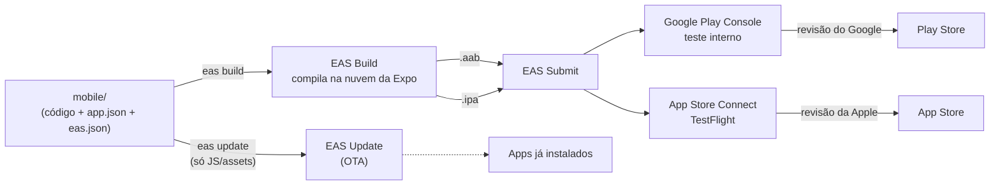

# Deploy do Mobile (Expo + EAS) — Play Store e App Store

Guia de ponta a ponta pra tirar o app de `mobile/` do seu computador e colocar nas lojas: como o deploy funciona neste monorepo, o que precisa configurar em cada projeto novo, como gerar build local, como publicar na Google Play e na App Store e como mandar atualizações depois.

> **Projeto novo a partir do template?** O deploy já vem configurado, mas com a identidade de exemplo do template (`base`). **Antes do primeiro build, faça a [seção 5](#5-setup-inicial-do-projeto-uma-vez-por-projeto)**, senão você builda e publica no projeto errado.

## Sumário
1. [Visão geral](#1-visão-geral)
2. [O que já vem configurado (e o que não vem)](#2-o-que-já-vem-configurado-e-o-que-não-vem)
3. [Conceitos rápidos](#3-conceitos-rápidos)
4. [Pré-requisitos: contas, acessos e ferramentas](#4-pré-requisitos-contas-acessos-e-ferramentas)
5. [Setup inicial do projeto (uma vez por projeto)](#5-setup-inicial-do-projeto-uma-vez-por-projeto)
6. [Build local](#6-build-local)
7. [Build na nuvem (EAS Build)](#7-build-na-nuvem-eas-build)
8. [Publicando na Google Play](#8-publicando-na-google-play)
9. [Publicando na App Store](#9-publicando-na-app-store)
10. [Versões e atualizações (build nova x OTA)](#10-versões-e-atualizações-build-nova-x-ota)
11. [CI/CD com GitHub Actions](#11-cicd-com-github-actions)
12. [Checklist de release](#12-checklist-de-release)
13. [Problemas comuns](#13-problemas-comuns)
14. [Links](#14-links)

---

## 1. Visão geral

O mobile é um app **Expo (SDK 55, React Native 0.83)** com **Expo Router**. Todo o deploy é feito com o **EAS** (Expo Application Services), o serviço de nuvem da Expo:



| Ferramenta | Pra que serve | Onde está no repo |
|---|---|---|
| **Expo SDK 55** / React Native 0.83 | Framework do app | [mobile/package.json](../package.json) |
| **app.json** | Configuração do app: nome, ícone, splash, IDs das lojas, plugins, dono na Expo | [mobile/app.json](../app.json) |
| **CNG / `expo prebuild`** | Gera as pastas nativas `android/` e `ios/` a partir do `app.json`. Elas **não são versionadas** (estão no [.gitignore](../.gitignore)) | script `prebuild` |
| **EAS CLI** (`eas`) | CLI que conversa com os serviços da Expo | instalado globalmente |
| **EAS Build** | Compila `.aab`/`.apk`/`.ipa` na nuvem e guarda as credenciais de assinatura | [mobile/eas.json](../eas.json) → `build` |
| **EAS Submit** | Envia o binário pra Play Console e App Store Connect | [mobile/eas.json](../eas.json) → `submit` |
| **EAS Update** | Atualização OTA (manda JS novo sem passar pela loja) | `expo-updates` + `runtimeVersion`/`updates` no `app.json` |
| **GitHub Actions** | Valida PRs, publica OTA, dispara builds e faz o release por tag | [eas.yml](../../.github/workflows/eas.yml) e [mobile-release.yml](../../.github/workflows/mobile-release.yml) |
| **pnpm workspaces** | Monorepo; `node-linker=hoisted` na raiz, que é o modo que o Expo espera | [.npmrc](../../.npmrc), [pnpm-workspace.yaml](../../pnpm-workspace.yaml) |
| **Google Play Console** / **App Store Connect** | Painéis das lojas: ficha, testes, revisão, publicação | fora do repo |

Os projetos da empresa ficam na organização **`polijr`** da Expo. O template não fixa o `owner` no `app.json`: a conta dona do projeto é escolhida no `eas init` ([5.2](#52-criar-o-projeto-no-eas)).

---

## 2. O que já vem configurado (e o que não vem)

| Item | Onde | Situação |
|---|---|---|
| Profiles de build `development`, `preview` e `production` | [eas.json](../eas.json) | Pronto |
| Versão de build automática (`versionCode`/`buildNumber`) | `eas.json` → `appVersionSource: "remote"` + `autoIncrement` | Pronto |
| Envio pra Play Store (trilha interna, como rascunho) | `eas.json` → `submit.production.android` | Pronto. Falta a service account ([8.4](#84-service-account-pro-eas-submit)) |
| Envio pra App Store | `eas.json` → `submit.production.ios` | **Falta o `ascAppId`** ([5.3](#53-o-easjson)) |
| OTA (EAS Update) com `runtimeVersion` por fingerprint | `app.json` → `runtimeVersion`, `updates.url` | Pronto. **Refaça o `updates.url` depois do `eas init`** ([5.2](#52-criar-o-projeto-no-eas)) |
| Splash pelo plugin `expo-splash-screen` | `app.json` → `plugins` | Pronto. Troque a imagem ([5.1](#51-identidade-do-app)) |
| IDs das lojas (`bundleIdentifier` / `package`) | `app.json` | **Vêm com o valor de exemplo do template (`br.com.polijunior.base`). Troque** ([5.1](#51-identidade-do-app)) |
| Projeto no EAS (`projectId`, `slug`, `scheme`) | `app.json` | **Vêm com os valores de exemplo do template (`base`). Troque** ([5.1](#51-identidade-do-app), [5.2](#52-criar-o-projeto-no-eas)) |
| Variáveis `EXPO_PUBLIC_*` no EAS | expo.dev | **Não vêm cadastradas.** Sem elas, o app buildado não acha o backend ([5.4](#54-variáveis-de-ambiente-no-eas)) |
| CI: validação em PR, OTA em push e build manual | [eas.yml](../../.github/workflows/eas.yml) | Pronto. **Falta o secret `EXPO_TOKEN`** ([11](#11-cicd-com-github-actions)) |
| Release por tag (`mobile-vX.Y.Z` → build + envio pras lojas) | [mobile-release.yml](../../.github/workflows/mobile-release.yml) | Pronto. Pro iOS, falta o `ascAppId` ([11](#lançar-uma-versão-nas-lojas-release-por-tag)) |
| Conferência de deploy antes de publicar | [scripts/check-deploy-config.js](../scripts/check-deploy-config.js) | Pronto. Roda em todos os jobs do CI ([11](#conferência-de-deploy)) |
| Credenciais de assinatura (keystore, certificados) | EAS | Geradas no primeiro build interativo ([7](#7-build-na-nuvem-eas-build)) |
| Arquivos de credencial fora do git | [.gitignore](../.gitignore) | Pronto (`credentials.json`, `google-service-account*.json`, `*.jks`, `*.p8`, `*.p12`…) |

**O app em si ainda tem pendências que as lojas cobram:** a tela de login mostra "Sign In with Google" sem ter Sign in with Apple, e não existe exclusão de conta dentro do app. Detalhes e correção em [9.8](#98-motivos-de-rejeição-que-este-template-provoca).

**Sobre a versão do SDK:** o template está no SDK 55, e o Expo já está no 57 (o 58 está em beta). O SDK 55 ainda builda no EAS e atende às exigências atuais das lojas: `targetSdk` 36 no Android (exigido pelo Google desde 31/08/2026) e Xcode 26.2 no iOS (a Apple exige Xcode 26+ desde 28/04/2026). Mesmo assim, vale planejar o upgrade seguindo o guia de upgrade do Expo, lembrando do aviso do [README](../../README.md) de manter a mesma versão do React no web e no mobile. Outro motivo pro upgrade: o Expo Go da loja só roda o SDK mais recente ([seção 6.1](#61-rodar-em-desenvolvimento-sem-build)).

---

## 3. Conceitos rápidos

- **Build x Update.** *Build* gera o binário nativo (`.aab`, `.apk`, `.ipa`) que vai pra loja e passa por revisão. *Update* (OTA) troca só o JavaScript e os assets de um app já instalado, sem loja. Qualquer mudança nativa (lib nova com código nativo, permissão, ícone, splash, plugin, versão do SDK) **exige build nova**.
- **Profiles do `eas.json`.** Receitas de build: `development` (dev client pra debug), `preview` (instalável direto no celular, pra QA/cliente) e `production` (vai pra loja).
- **Formatos.** Android: `.apk` instala direto no celular; `.aab` (App Bundle) é o formato que a Play Store aceita. iOS: `.ipa`, que só instala via TestFlight/App Store ou em aparelhos cadastrados.
- **Versões.** `version` no `app.json` (ex. `1.2.0`) é a versão que o usuário vê. `versionCode` (Android) e `buildNumber` (iOS) são números internos que **precisam subir a cada upload**. Com `appVersionSource: "remote"` + `autoIncrement`, o EAS cuida deles.
- **Credenciais.** Android: um *keystore* (chave de upload). iOS: *distribution certificate* + *provisioning profile*. O EAS gera e guarda os dois; você quase nunca mexe neles na mão.
- **Channel/branch (EAS Update).** Cada build nasce "escutando" um *channel* (ex. `production`), e o `eas update` publica nesse channel. O update só chega em builds com o mesmo `runtimeVersion`.

---

## 4. Pré-requisitos: contas, acessos e ferramentas

### Contas (peça pra liderança/coord)

| Conta | Custo | Pra quê | Observação |
|---|---|---|---|
| **Expo** — organização `polijr` | Grátis no plano Free (cotas em [seção 7](#7-build-na-nuvem-eas-build)) | EAS Build/Submit/Update | Você precisa ser membro da org com papel de *Developer* ou superior |
| **Apple Developer Program** | US$ 99/ano | Publicar na App Store e no TestFlight | Pra criar certificados: papel *Admin* ou *Account Holder*. Pra subir app: *App Manager* no App Store Connect |
| **Google Play Console** | US$ 25, pagamento único | Publicar na Play Store | Pra criar app e mexer em releases: permissão de *Admin* ou equivalente no app |

> **Decida cedo em qual conta o app vai ser publicado: a da Poli Jr ou a do cliente.** O `package`/`bundleIdentifier` e a conta de publicação são muito difíceis de trocar depois (a transferência entre contas existe nas duas lojas, mas é burocrática). Se o app é do cliente, o ideal é publicar na conta dele desde o início, com a gente convidado como usuário.

### Ferramentas locais

```bash
# Node 22 LTS e pnpm 10
# (o SDK 55 aceita Node ^20.19.4, ^22.13.0 ou ^24.3.0; o Node 20 está fora de suporte)
node -v
pnpm -v

# EAS CLI (global) — ou use "npx eas-cli@latest <comando>" sem instalar
npm install -g eas-cli
eas --version
eas login          # entre com a sua conta Expo (membro da org polijr)
eas whoami
```

Só pra build **local** (ver [seção 6](#6-build-local)):
- **Android**: JDK 17, Android SDK e NDK (o EAS usa o NDK 27.1.12297006 no SDK 55). O jeito mais fácil é instalar o Android Studio e apontar `ANDROID_HOME` pro SDK. O `npx expo run:android` funciona em macOS, Linux e Windows. Já o `eas build --local` é só macOS/Linux (no Windows, só via WSL, sem suporte oficial).
- **iOS** (**só macOS**): Xcode 26 ou mais novo (o EAS usa o 26.2 no SDK 55), CocoaPods e fastlane (`brew install cocoapods fastlane`).

---

## 5. Setup inicial do projeto (uma vez por projeto)

Faça tudo desta seção dentro de `mobile/`, na primeira vez que for preparar o app pra loja.

### 5.1. Identidade do app

Edite o [app.json](../app.json). Estes campos vêm com os valores de exemplo do template (`base`) e **têm que ser trocados** (o resto do arquivo fica como está):

```jsonc
{
  "expo": {
    "name": "Nome do App",            // nome que aparece embaixo do ícone
    "slug": "nome-do-app",            // identificador do projeto na Expo
    "scheme": "nomedoapp",            // deep link (nomedoapp://), usado no login
    "version": "1.0.0",               // versão visível ao usuário
    "ios": {
      "bundleIdentifier": "br.com.polijunior.nomedoapp",
      "supportsTablet": true          // false = sem versão de iPad (e sem screenshots de iPad na loja)
    },
    "android": {
      "package": "br.com.polijunior.nomedoapp"
    }
  }
}
```

> O `app.json` não aceita comentários: eles estão aí só pra explicar.

Regras:
- `bundleIdentifier` e `package` usam domínio reverso (`br.com.<empresa>.<app>`), só letras minúsculas, números e pontos. **Depois do primeiro envio pra loja eles nunca mais mudam.** Se o app vai pra conta do cliente, use o domínio do cliente.
- O **scheme precisa bater em três lugares**, senão o login (Better Auth) quebra:
  1. `scheme` no [mobile/app.json](../app.json)
  2. `EXPO_PUBLIC_SCHEMA` no `.env` do mobile e nas variáveis do EAS (passo 5.4)
  3. `trustedOrigins` no backend, em [web/src/auth.ts](../../web/src/auth.ts) (`"nomedoapp://"` e `"nomedoapp://*"`)
- O `ios.config.usesNonExemptEncryption: false`, que já vem no `app.json`, diz à Apple que o app só usa criptografia padrão (HTTPS). Com isso, o App Store Connect não pergunta sobre criptografia a cada envio. Só mude se o app implementar criptografia própria.

**Ícones e splash.** Os arquivos em [assets/](../assets) são os placeholders do template. Troque por:
- `icon.png` — 1024×1024, PNG **sem transparência** (a Apple rejeita ícone com canal alfa).
- `adaptive-icon.png` — 1024×1024, com o desenho dentro do círculo central (~66% da imagem), porque cada fabricante corta o ícone de um jeito.
- `splash-icon.png` — o **logo** do splash (PNG com fundo transparente), não uma tela cheia. Ele é configurado pelo plugin `expo-splash-screen`, em `plugins` no `app.json`: `backgroundColor` é a cor de fundo, e `imageWidth` é a largura do logo na tela, em dp.

### 5.2. Criar o projeto no EAS

```bash
cd mobile
# 1. apague "extra.eas.projectId" do app.json (senão você fica preso ao projeto do template)
# 2. crie o projeto novo na org polijr (grava o novo projectId no app.json):
eas init --account polijr
# 3. aponte o OTA pro projeto novo (reescreve o "updates.url" do app.json):
eas update:configure
```

Sem o `--account`, o `eas init` pergunta qual conta vai ser a dona do projeto: escolha `polijr` (ou a conta do cliente). Se preferir fixar, coloque `"owner": "polijr"` no `app.json`.

O `updates.url` tem o `projectId` dentro (`https://u.expo.dev/<projectId>`). Confira se ele terminou com o **novo** `projectId`; se não, troque na mão. Se esse passo for esquecido, os builds procuram OTA no projeto antigo e os updates nunca chegam. O CI confere isso ([seção 11](#conferência-de-deploy)). Commite as mudanças.

### 5.3. O `eas.json`

O [eas.json](../eas.json) já vem assim:

```json
{
  "cli": {
    "version": ">= 24.0.0",
    "appVersionSource": "remote"
  },
  "build": {
    "development": {
      "developmentClient": true,
      "distribution": "internal",
      "environment": "development",
      "channel": "development"
    },
    "preview": {
      "distribution": "internal",
      "environment": "preview",
      "channel": "preview",
      "android": {
        "buildType": "apk"
      }
    },
    "production": {
      "environment": "production",
      "channel": "production",
      "autoIncrement": true
    }
  },
  "submit": {
    "production": {
      "android": {
        "track": "internal",
        "releaseStatus": "draft"
      }
    }
  }
}
```

O que cada parte faz:
- **`cli.version`** — versão mínima do eas-cli pra mexer no projeto. O SDK 55 precisa de pelo menos a 18.0.5; hoje a atual é a 24.8.0.
- **`appVersionSource: "remote"` + `autoIncrement: true`** — o EAS guarda `versionCode`/`buildNumber` nos servidores dele e incrementa sozinho a cada build de produção, e os valores do `app.json` passam a ser ignorados. Você só mexe no `version` do `app.json` quando lança versão nova pro usuário.
  - **Por que o `autoIncrement` só está no `production`:**
    - **A loja exige número novo.** Ela recusa upload com `versionCode`/`buildNumber` repetido, e só o `production` vai pra loja.
    - **`preview` e `development` não passam pela loja.** São instalados direto no celular e só reaproveitam o número atual, que é o do último build de produção.
    - **O contador é um só.** Ele é por app e plataforma, compartilhado entre os profiles. Se o preview também incrementasse, cada build de QA gastaria um número e a produção pularia (ex.: do 3 pro 9).
- **`environment`** — de qual ambiente do EAS vêm as variáveis (passo 5.4).
- **`channel`** — de qual channel do EAS Update o build recebe OTA (passo 5.5).
- **`development`** — exige `npx expo install expo-dev-client`, que não vem instalado (ele muda o `expo start` pra abrir o dev client em vez do Expo Go). O EAS oferece instalar na primeira vez que você usar esse profile.
- **`preview`** — `distribution: internal` gera um build instalável direto (APK no Android); não vai pra loja.
- **`submit.production.android`** — `track: "internal"` manda pra trilha de teste interno (mais seguro que ir direto pra produção). `releaseStatus: "draft"` é **obrigatório enquanto o app nunca foi publicado** na Play Store; depois dá pra trocar por `"completed"`.
- **Node/pnpm no build** — a imagem `sdk-55` do EAS já vem com Node 20.19.4 e pnpm 10.28.2. Pra fixar outra versão, use os campos `node`/`pnpm` no profile (ex. `"node": "22.13.0"`).

**Falta um campo**, que só existe depois de criar o app no App Store Connect ([9.3](#93-criar-o-app-no-app-store-connect)): o `ascAppId`. Adicione em `submit.production`:

```json
"ios": {
  "ascAppId": "1234567890"
}
```

Sem ele, o `eas submit` pro iOS só funciona no modo interativo (não roda no CI). **O `ascAppId` é por app: nunca copie de outro projeto.** Se o app for pra conta Apple da Poli Jr, dá pra adicionar também `"appleTeamId": "82L63Y7JQJ"` (o time que o `eas.json` antigo usava).

Se o app já existe nas lojas e você está migrando pro `remote`, sincronize o número atual antes do primeiro build:

```bash
eas build:version:set -p android   # informe o último versionCode enviado
eas build:version:set -p ios       # informe o último buildNumber enviado
```

### 5.4. Variáveis de ambiente no EAS

O `.env` só vale na sua máquina. Pro build na nuvem (e pro OTA), as variáveis ficam cadastradas no EAS, separadas por ambiente:

```bash
cd mobile

# produção (loja)
eas env:set --environment production --name EXPO_PUBLIC_BACKEND_URL --value "https://nomedoapp.vercel.app" --visibility plaintext
eas env:set --environment production --name EXPO_PUBLIC_SCHEMA      --value "nomedoapp"                   --visibility plaintext

# preview (QA / cliente) — pode apontar pra um backend de staging
eas env:set --environment preview --name EXPO_PUBLIC_BACKEND_URL --value "https://staging-nomedoapp.vercel.app" --visibility plaintext
eas env:set --environment preview --name EXPO_PUBLIC_SCHEMA      --value "nomedoapp"                           --visibility plaintext

# conferir
eas env:list --environment production

# trazer as variáveis de um ambiente pro seu .env local
eas env:pull --environment development
```

Também dá pra cadastrar pelo site: expo.dev → projeto → **Environment variables**.

- **Tudo que começa com `EXPO_PUBLIC_` vai embutido no JavaScript do app** e qualquer pessoa consegue extrair. **Nunca coloque segredo aí** (chave de API privada, senha, token). Segredo fica no backend (`web/`).
- A URL do backend precisa ser **HTTPS e pública**. `localhost` ou IP da sua rede não funcionam no app instalado da loja.
- Use visibilidade `plaintext` ou `sensitive` nas `EXPO_PUBLIC_*`. Variáveis `secret` não ficam disponíveis pro `eas update`, pro build local nem pra leitura do `app.json`.
- Tutoriais antigos usam `eas env:create`, que está deprecated desde o eas-cli 21. Use `eas env:set` (cria ou atualiza).

### 5.5. OTA com EAS Update

Já vem configurado: `expo-updates` instalado, `updates.url` e `runtimeVersion: { "policy": "fingerprint" }` no `app.json`, e um `channel` por profile no `eas.json`.

- A política `fingerprint` calcula a versão de runtime a partir de tudo que é nativo: dependências nativas, config plugins e `app.json`. Um update só chega em builds com o mesmo fingerprint, então ele nunca cai num build com código nativo incompatível.
- Só builds feitos com o `expo-updates` instalado recebem OTA.
- Depois do `eas init`, rode `eas update:configure` (passo 5.2).
- Não quer OTA no projeto? Rode `pnpm remove expo-updates` em `mobile/`, apague `runtimeVersion` e `updates` do `app.json` e remova o job `update` do [workflow](../../.github/workflows/eas.yml).

---

## 6. Build local

Tem quatro jeitos de rodar/gerar o app na sua máquina, do mais simples ao mais completo.

### 6.1. Rodar em desenvolvimento (sem build)

```bash
# na raiz do monorepo
pnpm install

cd mobile
cp .env.example .env    # e ajuste EXPO_PUBLIC_BACKEND_URL
pnpm start              # abre o Metro; escaneie o QR code com o Expo Go
pnpm android            # abre no emulador Android
pnpm ios                # abre no simulador iOS (só macOS)
```

- O app usa só módulos do Expo SDK, então roda no **Expo Go**. Mas o **Expo Go da loja só roda o SDK mais recente** (hoje o 57), e o template está no 55. No simulador iOS e no emulador Android, o `expo start` instala a versão certa do Expo Go sozinho. No celular físico, instale a versão do SDK 55 (Android: [expo.dev/go](https://expo.dev/go)) ou use um *development build* (`npx expo install expo-dev-client` + `eas build --profile development`).
- No celular físico, o backend precisa estar acessível pela rede: use o IP da sua máquina (`http://192.168.x.x:3000`) no `EXPO_PUBLIC_BACKEND_URL`, não `localhost`.

### 6.2. Build nativo local com `expo run` (APK/app de teste)

Gera as pastas nativas e compila com o Android SDK/Xcode da sua máquina:

```bash
cd mobile
npx expo prebuild --clean                       # gera android/ e ios/ (ignoradas no git)

npx expo run:android --variant release          # compila e instala no emulador/celular conectado
npx expo run:ios --configuration Release        # só macOS
```

- O APK fica em `mobile/android/app/build/outputs/apk/release/app-release.apk`. Dá pra mandar esse arquivo pra alguém instalar.
- **Esse APK é assinado com a chave de debug**: serve pra teste, **não serve pra Play Store**.
- Nunca edite `android/` ou `ios/` na mão: elas são regeneradas pelo `prebuild`. Mudança nativa se faz no `app.json` ou com config plugins.

### 6.3. `eas build --local` (recomendado pra build de loja na sua máquina)

Roda **o mesmo processo do EAS Build**, com o mesmo `eas.json`, as credenciais guardadas no EAS e as variáveis de ambiente do EAS, só que no seu computador. Não gasta cota de build na nuvem.

```bash
cd mobile

# APK de preview (instala direto no Android)
eas build --platform android --profile preview --local --output ./build/app-preview.apk

# AAB de produção (Play Store)
eas build --platform android --profile production --local --output ./build/app.aab

# IPA de produção (App Store) — só macOS
eas build --platform ios --profile production --local --output ./build/app.ipa

# depois, envie o arquivo gerado pra loja
eas submit --platform android --path ./build/app.aab
eas submit --platform ios --path ./build/app.ipa
```

- A pasta `mobile/build/` já está no [.gitignore](../.gitignore).
- Requisitos: os mesmos da [seção 4](#ferramentas-locais). Só macOS/Linux (no Windows, só via WSL, sem suporte oficial).
- Limitações: builda **uma plataforma por vez**, não tem cache, usa o Node/Xcode/JDK da sua máquina (ignora os campos de versão do `eas.json`) e não enxerga variáveis `secret`. O eas-cli marca o `--local` como experimental.

### 6.4. Build 100% manual (Android Studio / Xcode)

Último recurso, pra quando precisar depurar algo nativo:

```bash
cd mobile
npx expo prebuild --clean
# Android: gera AAB/APK (precisa configurar o keystore de upload no gradle pra ir pra loja)
cd android && ./gradlew bundleRelease     # → android/app/build/outputs/bundle/release/app-release.aab
cd android && ./gradlew assembleRelease   # → android/app/build/outputs/apk/release/app-release.apk
# iOS: abra ios/<Nome>.xcworkspace no Xcode → Product → Archive → Distribute App
```

Prefira o 6.3: ele já assina com as credenciais certas e usa o mesmo `versionCode`/`buildNumber` do EAS.

---

## 7. Build na nuvem (EAS Build)

É o caminho padrão. Roda nos servidores da Expo, então funciona de qualquer SO (inclusive gerar iOS no Windows).

```bash
cd mobile

# QA / cliente
eas build --platform android --profile preview        # gera APK com link de download/QR code
eas build --platform ios --profile preview            # IPA ad hoc (precisa dos aparelhos cadastrados, ver abaixo)

# loja
eas build --platform all --profile production
eas build --platform all --profile production --auto-submit   # já envia pras lojas quando terminar

# acompanhar
eas build:list
```

O build aparece em expo.dev → projeto → **Builds**, com logs, link de download e QR code.

**Primeiro build de cada plataforma** (faça interativo, na sua máquina, não no CI):
- **Android:** o EAS pergunta se pode gerar um keystore; responda sim. **Esse keystore é a chave de upload do app.** Ele fica guardado no EAS, mas baixe um backup (`eas credentials -p android` → *Download credentials*) e guarde no cofre de senhas da empresa.
- **iOS:** o EAS pede login com o Apple ID, você escolhe o time e ele cria sozinho o Bundle ID, o *distribution certificate* e o *provisioning profile*. Precisa de papel *Admin* no Apple Developer.

**Preview no iOS:** build `internal` só instala em aparelhos cadastrados. Cadastre com `eas device:create` (gera um link/QR pra pessoa abrir no iPhone) e faça o build **depois** disso. Pra muitos testadores, o TestFlight é mais simples ([seção 9.5](#95-testflight)).

**Cota do plano Free:** até 15 builds Android e 15 iOS por mês, em fila de baixa prioridade (pode demorar) e com timeout de 45 min por build. O EAS Update tem limite de 1.000 usuários ativos por mês, sem excedente (é um teto). Se a cota de build acabar, use o `eas build --local` ([seção 6.3](#63-eas-build---local-recomendado-pra-build-de-loja-na-sua-máquina)).

---

## 8. Publicando na Google Play

### 8.1. Conta de desenvolvedor

- Crie/acesse a conta em [play.google.com/console](https://play.google.com/console). Taxa: US$ 25, pagamento único.
- Conta de **organização** exige D-U-N-S number e passa por verificação da empresa.
- **Conta pessoal criada depois de 13/11/2023:** antes de liberar produção, o Google exige um **teste fechado com pelo menos 12 testadores inscritos por 14 dias seguidos**. A regra vale para contas pessoais; contas de organização não aparecem nela. Mais um motivo pra publicar numa conta de organização (Poli Jr ou cliente).
- **Verificação de desenvolvedor Android:** o Google passou a exigir registro/verificação dos desenvolvedores, e o prazo pro Brasil é **30/09/2026**. Segundo o Google, a Play registra 99% dos apps sozinha, mas confira no Play Console se a conta e os apps estão em dia.
- **Target API:** desde 31/08/2026, apps novos e atualizações precisam mirar o Android 16 (API 36). O SDK 55 já usa `targetSdk` 36.

### 8.2. Criar o app no Play Console

Play Console → **Criar app**:
- Nome do app, idioma padrão (Português – Brasil), **App** (não jogo), **Gratuito** ou pago. Um app gratuito **não pode virar pago depois**.
- Aceite as declarações (políticas e leis de exportação dos EUA).

### 8.3. Primeiro envio

Antigamente o primeiro AAB tinha que ser enviado na mão. **Não precisa mais**: com o app criado no Play Console (8.2) e a service account configurada (8.4), o `eas submit` cria a primeira versão direto na trilha de **teste interno** ([8.5](#85-enviar-builds-novos)).

O que continua sendo feito no Play Console nesse primeiro envio:
- **Play App Signing:** é obrigatório em app novo. O Google guarda a chave de assinatura final, e o keystore do EAS vira só a chave de *upload*. Se o keystore for perdido, dá pra pedir ao Google a troca da chave de upload.
- **Testadores:** em **Testar e lançar → Teste interno → Testadores**, crie uma lista de e-mails e mande o link de opt-in pra equipe/cliente.

Se preferir subir na mão, também funciona: baixe o `.aab` do build e envie em **Testar e lançar → Teste interno → Criar nova versão**.

### 8.4. Service account pro `eas submit`

Pra enviar direto pelo EAS (e pelo CI), o Google exige uma *service account* com acesso ao app:

1. **Google Cloud Console** ([console.cloud.google.com](https://console.cloud.google.com)): crie ou escolha um projeto → ative a **Google Play Android Developer API**.
2. **IAM e administrador → Contas de serviço → Criar conta de serviço.** Não precisa dar papel no Cloud.
3. Na conta criada: **Chaves → Adicionar chave → JSON**. Baixe o arquivo. **Ele é um segredo**: não commite, não mande no Slack.
4. **Play Console → Usuários e permissões → Convidar novos usuários**: cole o e-mail da service account (`...@...iam.gserviceaccount.com`) e dê, no app (ou na conta toda), as permissões: *ver informações do app*, *editar e excluir apps em rascunho*, *lançar em produção*, *lançar em trilhas de teste*, *gerenciar trilhas de teste e listas de testadores* e *gerenciar presença na loja*.
5. Guarde a chave no EAS, pra ninguém precisar do arquivo local nem no CI:
   ```bash
   cd mobile
   eas credentials -p android
   # → production → Google Service Account → Upload a Google Service Account Key → caminho do JSON
   ```
   Alternativa: `"serviceAccountKeyPath": "./google-service-account.json"` no `submit.production.android` do `eas.json`. O padrão `google-service-account*.json` já está no `.gitignore`, mas confira antes de commitar.

A permissão pode levar algumas horas pra valer. Se o submit der `The caller does not have permission`, espere e tente de novo.

### 8.5. Enviar builds novos

```bash
cd mobile
eas submit -p android --profile production --latest   # último build de produção do EAS
# ou
eas build -p android --profile production --auto-submit
```

O build vai pra trilha definida no `eas.json` (`internal`).

### 8.6. Conteúdo do app (obrigatório antes de produção)

Play Console → **Política → Conteúdo do app**. Todos os itens precisam estar verdes:

| Item | O que preencher | Atenção neste template |
|---|---|---|
| **Política de privacidade** | URL pública | Obrigatória, o app coleta e-mail/nome |
| **Acesso ao app** | Instruções + **conta de teste** (e-mail/senha) | **Obrigatório**: o app redireciona tudo pro login ([AuthContext.tsx](../contexts/AuthContext.tsx)) |
| **Anúncios** | O app tem anúncios? | |
| **Classificação do conteúdo** | Questionário IARC | |
| **Público-alvo** | Faixa etária | Se incluir crianças, entram regras extras (Families) |
| **Segurança dos dados** | Que dados coleta, por quê, se criptografa em trânsito, se permite excluir | Declare e-mail, nome, ID de usuário (auth) |
| **Exclusão de conta** | URL onde o usuário pede a exclusão da conta e dos dados | **Obrigatório** se o app permitir criar conta (o `signUp` já existe no `AuthContext`) |
| **ID de publicidade** | Se usa o Advertising ID | |
| Apps governamentais, recursos financeiros, saúde | Declarações | Normalmente "não" |

### 8.7. Ficha da loja

**Crescer → Presença na loja → Ficha principal da loja**:
- Nome (até 30 caracteres), descrição curta (até 80), descrição completa (até 4000).
- Ícone 512×512 PNG, **gráfico de recursos** 1024×500.
- Screenshots de celular (mínimo 2). Tablet é opcional.
- Categoria, e-mail de contato, site.

### 8.8. Da trilha interna pra produção

1. **Teste interno** → valide com a equipe/cliente.
2. (Se exigido pela sua conta) **Teste fechado** com os testadores pelo período mínimo — ver [8.1](#81-conta-de-desenvolvedor).
3. **Produção → Criar nova versão** (ou *Promover versão* a partir do teste) → escolha os países → **Revisar versão → Iniciar lançamento**.
4. O Google revisa. Costuma levar de algumas horas a poucos dias (o primeiro envio demora mais).
5. Use **lançamento gradual** (ex.: 20% → 50% → 100%) pra reduzir o risco de bug em massa.

Depois do primeiro lançamento em produção, você pode trocar o `releaseStatus` do `eas.json` pra `"completed"` e, se quiser, o `track` pra `"production"`.

---

## 9. Publicando na App Store

### 9.1. Conta de desenvolvedor

- [developer.apple.com/programs](https://developer.apple.com/programs). Taxa: US$ 99/ano. Conta de organização exige D-U-N-S.
- Quem vai rodar o primeiro build precisa ser **Admin** no time (pra criar certificados). Pra subir builds e editar a ficha, basta **App Manager** no App Store Connect.
- Desde 28/04/2026, a Apple só aceita builds feitos com **Xcode 26+ (SDK do iOS 26)**. O EAS usa o Xcode 26.2 no SDK 55, então o build na nuvem já atende. No build local, confira sua versão do Xcode.

### 9.2. Bundle ID e credenciais

Não precisa fazer nada na mão: no primeiro `eas build -p ios --profile production` (interativo), o EAS:
- registra o `bundleIdentifier` do `app.json` no Apple Developer;
- cria o *distribution certificate* e o *provisioning profile*;
- guarda tudo no EAS (veja em `eas credentials -p ios`).

Se o app usar capacidades como push notification, Sign in with Apple ou associated domains, o EAS habilita no Bundle ID com base nos plugins/`app.json`.

### 9.3. Criar o app no App Store Connect

[appstoreconnect.apple.com](https://appstoreconnect.apple.com) → **Apps → + → Novo app**:
- Plataforma iOS, **nome** (até 30 caracteres e único na App Store inteira), idioma principal, **Bundle ID** (o do `app.json`), **SKU** (código interno qualquer, ex. `nomedoapp-ios`).
- Depois de criado, vá em **Informações do app** e copie o **Apple ID** (número). É o `ascAppId` do `eas.json`.

> O `eas submit` interativo também cria o app pra você, se ele ainda não existir.

### 9.4. Chave de API do App Store Connect (pro CI)

Pra o `eas submit` rodar sem login/2FA (no CI, por exemplo), use uma chave de API:

```bash
cd mobile
eas credentials -p ios
# → production → App Store Connect: Manage your API Key → Set up a new API Key
```

O EAS cria a chave (ou você sobe uma criada em App Store Connect → Usuários e acesso → Integrações → Chaves) e passa a usar ela no submit. No modo não interativo (CI), o `eas submit` também exige o `ascAppId` preenchido no `eas.json`. Sem ele, o EAS tenta criar o app pedindo login no Apple ID e falha.

### 9.5. TestFlight

O TestFlight é o jeito oficial da Apple de colocar um build de teste no iPhone de alguém antes da loja. Pra testar em iPhone de verdade, ele é mais simples que o build `preview` ([seção 7](#7-build-na-nuvem-eas-build)): o testador instala por um app da Apple, sem cadastrar o aparelho.

| | Build `preview` (ad hoc) | TestFlight |
|---|---|---|
| Cadastro do aparelho | Sim: o UDID de cada iPhone (`eas device:create`) | Não |
| Login na conta Apple | A cada aparelho novo, pra gerar o profile de novo | Não, depois que a chave de API está configurada |
| Limite | 100 aparelhos de cada tipo por ano de assinatura | 100 testadores internos e 10.000 externos |
| Revisão da Apple | Não | Só pra testadores externos |
| API que o app usa | `preview` | `production` (ou um profile próprio, ver o fim desta seção) |

#### Os dois tipos de testador

| | Internos | Externos |
|---|---|---|
| Quem | Usuários do App Store Connect do time, com acesso ao app | Qualquer pessoa com e-mail: cliente, usuários beta |
| Limite | Até 100 | Até 10.000 |
| Como convida | Grupo interno no App Store Connect | E-mail ou link público |
| Revisão da Apple | Não | Sim: o primeiro build que entra num grupo passa pela *Beta App Review*. Os seguintes podem não precisar de revisão completa |
| Quando recebe o build | Assim que termina o processamento | Depois da revisão |

Todo build fica disponível no TestFlight por **90 dias**. Depois disso ele some pros testadores.

#### Passo 1 — Mandar o build pro TestFlight

Pré-requisitos: app criado no App Store Connect com o `ascAppId` no `eas.json` ([9.3](#93-criar-o-app-no-app-store-connect)) e a chave de API configurada ([9.4](#94-chave-de-api-do-app-store-connect-pro-ci)).

```bash
cd mobile
# build + envio em um comando
eas build -p ios --profile production --auto-submit

# ou, com um build pronto
eas submit -p ios --profile production --latest --what-to-test "Login, cadastro e tela inicial"
```

- O `--what-to-test` preenche o campo **O que testar** que o testador vê no app do TestFlight.
- No App Store Connect, o build fica um tempo em **Processando** (de minutos a mais de meia hora). Depois ele aparece em **TestFlight → Builds iOS**, e a Apple manda um e-mail avisando.
- Se travar em **Missing Compliance**, confira o `ios.config.usesNonExemptEncryption: false` no `app.json` (já vem no template).

#### Passo 2 — Testadores internos (equipe)

1. **Dê acesso à pessoa.** Ela precisa ser usuária do App Store Connect: **Usuários e acesso → +**, informe o e-mail, escolha um papel (ex.: *Developer*) e dê acesso ao app. A pessoa aceita o convite por e-mail.
2. **Crie um grupo interno.** **TestFlight → Testes internos → +** (ex.: "Equipe NTec"). Ligue a **distribuição automática**, pra todo build novo entrar no grupo sozinho, e adicione os testadores.
3. **Opcional — mande o build pro grupo pelo EAS.** Coloque `"groups": ["Equipe NTec"]` no `submit.production.ios` do `eas.json`, ou passe `--groups "Equipe NTec"` no `eas submit`.

> Quando é o próprio EAS que cria o app no App Store Connect (primeiro `eas submit` interativo, sem `ascAppId`), ele já cria um grupo interno chamado **"Team (Expo)"**. Esse grupo recebe todo build novo automaticamente e já tem os usuários *Admin* do time.

#### Passo 3 — Testadores externos (cliente, beta)

1. **Preencha as informações de teste.** Em **TestFlight → Informações de teste**: descrição do app, e-mail pra receber feedback e os dados pra revisão da Apple (contato e **conta de demonstração**, porque o app exige login). Sem a conta de demonstração, o revisor não passa do login.
2. **Crie um grupo externo.** **TestFlight → Testes externos → +** (ex.: "Cliente").
3. **Mande o build pra revisão.** Adicione o build ao grupo, preencha **O que testar** e clique em **Enviar para revisão**. Só o primeiro build do grupo passa pela revisão completa.
4. **Convide os testadores.** Dá pra adicionar por **e-mail** ou ativar um **link público**. No link público, você pode limitar quantas pessoas entram e copiar o link pra mandar pro cliente.

#### Passo 4 — O testador instala

1. Instala o app **TestFlight** pela App Store.
2. Abre o convite (e-mail ou link público), toca em **Aceitar** e depois em **Instalar**.
3. Builds novos aparecem no próprio TestFlight, e dá pra ligar a atualização automática.
4. Pra mandar feedback: tira um screenshot dentro do app, compartilha com o TestFlight e escreve o comentário. Os crashes são enviados sozinhos.

#### Passo 5 — Ler o feedback

No App Store Connect, em **TestFlight → Feedback**, ou pelo terminal:

```bash
cd mobile
eas testflight:feedback   # screenshots e comentários dos testadores
eas testflight:crashes    # crashes reportados
```

Os dois comandos usam a chave de API do perfil de submit `production`.

#### TestFlight e OTA

O build do TestFlight é o **mesmo binário que vai pra loja** (profile `production`). Então ele usa as variáveis de `production`, ou seja, a API de produção, e escuta o channel `production`. Um `eas update --channel production` chega ao mesmo tempo nos testadores do TestFlight e nos usuários da loja.

#### (Opcional) TestFlight apontando pra staging

Se os testadores precisarem usar a API de preview/staging em vez da de produção, crie um profile próprio no `eas.json`:

```json
"testflight-staging": {
  "extends": "production",
  "environment": "preview",
  "channel": "preview"
}
```

```bash
eas build -p ios --profile testflight-staging --auto-submit-with-profile production
```

- O profile herda o `autoIncrement` do `production`. Isso é necessário porque **todo build que vai pro App Store Connect precisa de número novo**, mesmo que só vá pro TestFlight ([5.3](#53-o-easjson)).
- Esse build aparece na mesma lista de builds do App Store Connect. **Nunca selecione ele pra revisão da loja**: ele aponta pra API de staging.

### 9.6. Ficha da loja

Na aba da versão (ex. **1.0 Preparar para envio**):
- **Screenshots**: iPhone 6,9" (1320×2868, 1290×2796 ou 1260×2736). Se não mandar os de 6,9", os de 6,5" (1284×2778 ou 1242×2688) viram obrigatórios. **iPad 13" (2064×2752 ou 2048×2732) é obrigatório se o app roda em iPad**, e hoje roda, porque o `app.json` tem `supportsTablet: true`. De 1 a 10 imagens por tamanho, JPG ou PNG, sem transparência.
- Texto promocional, descrição, palavras-chave (até 100 caracteres), **URL de suporte** (obrigatória), URL de marketing.
- **Informações do app**: categoria, classificação etária (questionário), **URL da política de privacidade** (obrigatória).
- **Privacidade do app**: declare os dados coletados (e-mail, nome, ID de usuário) e a finalidade.
- **Preço e disponibilidade**: preço (grátis) e países.
- **Informações para revisão do app**: **conta de demonstração (usuário e senha)**, contato e observações. **Sem conta de teste a Apple rejeita**, porque o app exige login.

### 9.7. Enviar pra revisão

1. Na versão, em **Build**, selecione o build que está no TestFlight.
2. Escolha como lançar: **manualmente** depois de aprovado, **automaticamente**, ou numa data.
3. **Adicionar para revisão → Enviar para revisão do app.**
4. A revisão costuma levar de 1 a 2 dias. Se for rejeitado, a resposta chega na **Central de Resoluções**. Dá pra responder por lá ou corrigir e mandar build novo.
5. Opcional: **lançamento em fases** (7 dias, pra quem tem atualização automática).

### 9.8. Motivos de rejeição que este template provoca

| Diretriz | Problema | O que fazer |
|---|---|---|
| **2.1** Completude | Revisor não consegue logar | Mande a conta de demo e deixe o backend de produção no ar |
| **4.8** Serviços de login | A tela de login ([login.tsx](../app/%28auth%29/login.tsx)) já mostra o botão "Sign In with Google", e hoje ele nem funciona, porque o provider Google está comentado em [web/src/auth.ts](../../web/src/auth.ts). Quem usa login social pra conta principal tem que oferecer também uma opção equivalente que colete só nome e e-mail e deixe o usuário esconder o e-mail | Se for manter o Google, adicione **Sign in with Apple** (`expo-apple-authentication` + provider no Better Auth). Se não, tire o botão |
| **5.1.1(v)** Exclusão de conta | Se o app permite criar conta, a exclusão tem que estar **dentro do app**. O `signUp` já existe no `AuthContext` (o link de cadastro está comentado no login) | Implemente "Excluir minha conta" no app chamando `DELETE /api/users/[id]`: o backend já deixa o próprio usuário se excluir |
| **4.2** Funcionalidade mínima | App que é só um site embrulhado ou com telas de exemplo | Remova as telas de exemplo do template (`details.tsx`, `EditScreenInfo`) |
| **5.1.1** Permissões | Pedir câmera/localização/etc. sem explicar o motivo | Configure os textos de permissão (`ios.infoPlist` / plugin da lib) em português e específicos |

---

## 10. Versões e atualizações (build nova x OTA)

### Quando é build nova (passa pela loja)

- Adicionou ou atualizou lib com código nativo (qualquer uma que precise de `npx expo install` com plugin, ou que não funcione no Expo Go).
- Mudou algo nativo no `app.json`: ícone, splash, nome, permissões, plugins, `scheme`, IDs.
- Atualizou o SDK do Expo / React Native.

Passo a passo:
1. Suba o `version` no [app.json](../app.json) (ex. `1.0.0` → `1.1.0`). Na App Store, cada versão publicada precisa de um `version` novo; o `buildNumber`/`versionCode` o EAS incrementa sozinho.
2. Faça o merge até a `main` e crie a tag `mobile-vX.Y.Z`: o CI builda e envia pras lojas ([seção 11](#lançar-uma-versão-nas-lojas-release-por-tag)). Na mão, sem CI: `eas build -p all --profile production --auto-submit`.
3. **Android:** promova da trilha interna pra produção ([8.8](#88-da-trilha-interna-pra-produção)).
   **iOS:** App Store Connect → **+ Versão** → selecione o build → **Enviar para revisão** ([9.7](#97-enviar-pra-revisão)).

### Quando dá pra mandar OTA (sem loja)

Mudanças só em JS/TS, estilos e imagens importadas no código ([5.5](#55-ota-com-eas-update)). **O CI já faz isso sozinho** a cada push na `main` (channel `production`) e na `dev` (channel `preview`), ver [seção 11](#11-cicd-com-github-actions). Na mão:

```bash
cd mobile
eas update --channel production --environment production --message "fix: corrige texto da tela de login"
```

- No SDK 55+, o `--environment` é **obrigatório**: o `eas update` usa só as variáveis do EAS e ignora o `.env`. Cuidado: no CI (onde `CI=true`), o eas-cli **não reclama** se você esquecer a flag. O update sai sem as variáveis e o app quebra. Sempre passe `--environment`.
- Por padrão, o app baixa o update ao abrir e aplica **na próxima vez que for aberto**.
- Com `runtimeVersion: { policy: "fingerprint" }`, se você mudou algo nativo, o update simplesmente não chega nos builds antigos. Nada quebra, mas você precisa de build nova.
- Deu ruim? Volte pro update anterior: `eas update:rollback` (ou republique um update antigo com `eas update:republish`).
- **Regras das lojas:** OTA pode corrigir bug e ajustar a interface, mas **não pode mudar o propósito do app** nem adicionar funcionalidade que fuja do que foi revisado. Na dúvida, mande build nova.

---

## 11. CI/CD com GitHub Actions

São dois workflows:
- [eas.yml](../../.github/workflows/eas.yml) — o dia a dia: valida PRs, publica OTA e builda quando alguém dispara.
- [mobile-release.yml](../../.github/workflows/mobile-release.yml) — o lançamento: uma tag `mobile-vX.Y.Z` gera os builds de produção e envia pras lojas.

| Evento | Workflow → job | O que faz | Precisa de `EXPO_TOKEN`? |
|---|---|---|---|
| PR pra `dev`/`main` que mexe em `mobile/**`, `pnpm-lock.yaml` ou nos workflows | `eas.yml` → `validate` | `expo config`, conferência de deploy, `pnpm lint`, `tsc --noEmit` e bundle JS de Android e iOS | Não |
| Push na `dev` (em `mobile/**`) | `eas.yml` → `update` | `eas update` no channel e ambiente `preview` | Sim |
| Push na `main` (em `mobile/**`) | `eas.yml` → `update` | `eas update` no channel e ambiente `production` | Sim |
| Disparo manual | `eas.yml` → `build` | `eas build` com a plataforma e o profile escolhidos; opcionalmente envia pras lojas | Sim |
| Tag `mobile-vX.Y.Z` | `mobile-release.yml` → `release` | Build de produção + envio pras lojas | Sim |

Por que assim:
- **Merge não gera build.** Push na `main` só publica OTA. Build gasta cota e passa por revisão, então lançar versão é uma decisão: alguém cria a tag (ou dispara o build na mão). Com o `fingerprint`, se o merge mudou algo nativo, o OTA não chega nos builds antigos. É o sinal de que precisa de um release.
- **Os builds usam `--no-wait`.** O job termina em ~2 min e os builds seguem na nuvem da Expo. O `--auto-submit` manda pra loja do lado do EAS quando cada build termina. Ninguém paga minuto de Actions esperando.
- **A mensagem do commit e a tag passam por variável de ambiente**, e não direto no script, pra evitar *script injection*.
- **Sem o secret `EXPO_TOKEN`**, os jobs que usam o EAS falham logo no começo com um erro dizendo isso.

### Conferência de deploy

Antes de publicar, todos os jobs rodam o [scripts/check-deploy-config.js](../scripts/check-deploy-config.js). Ele para o workflow, com uma mensagem clara, quando:
- o `updates.url` do `app.json` não aponta pro `projectId`. Nesse caso os OTAs iriam pro projeto errado; resolve com `eas update:configure`;
- o workflow vai enviar pro iOS e falta o `ascAppId` no `eas.json`;
- no release, a tag não bate com o `version` do `app.json`.

Pra rodar local antes de abrir o PR:

```bash
cd mobile
node scripts/check-deploy-config.js
node scripts/check-deploy-config.js --tag mobile-v1.2.0 --ios-submit   # o que o release confere
```

### Secrets e variáveis

Em GitHub → repo → **Settings → Secrets and variables → Actions**:

| Nome | Onde | Como gerar / valores | Pra quê |
|---|---|---|---|
| `EXPO_TOKEN` | Secrets | expo.dev → org `polijr` → **Settings → Access tokens** (prefira token de um *robot user* da org, não pessoal) | Autenticar o `eas` no CI |
| `MOBILE_RELEASE_PLATFORM` | Variables (opcional) | `all` (padrão), `android` ou `ios` | Quais plataformas o release por tag builda e envia. Ex.: `android` enquanto a conta Apple ou o D-U-N-S do cliente não sai |

As outras credenciais **ficam no EAS, não no GitHub**: keystore e certificados (gerados no primeiro build), chave da service account do Google ([8.4](#84-service-account-pro-eas-submit)), chave de API da Apple ([9.4](#94-chave-de-api-do-app-store-connect-pro-ci)) e variáveis `EXPO_PUBLIC_*` ([5.4](#54-variáveis-de-ambiente-no-eas)). O secret `GOOGLE_SERVICES_JSON`, usado pela versão antiga do workflow, não é mais necessário.

### Lançar uma versão nas lojas (release por tag)

**Pré-requisitos (uma vez por projeto):**
- secret `EXPO_TOKEN` configurado;
- primeiro build de cada plataforma feito **interativo, na sua máquina** ([seção 7](#7-build-na-nuvem-eas-build)), pra gerar as credenciais;
- Android: service account do Google salva no EAS ([8.4](#84-service-account-pro-eas-submit));
- iOS: chave de API da Apple salva no EAS ([9.4](#94-chave-de-api-do-app-store-connect-pro-ci)) e `ascAppId` no `eas.json` ([5.3](#53-o-easjson)). Sem conta Apple ainda? Use `MOBILE_RELEASE_PLATFORM=android`.

**Passo a passo:**

1. **Suba o `version`** no [app.json](../app.json) (ex.: `1.1.0` → `1.2.0`) num PR normal.
2. **Faça o merge até a `main`.** O push na `main` já publica um OTA; o release é o que gera o binário novo.
3. **Crie a tag no commit da `main` e envie pro GitHub:**
   ```bash
   git switch main && git pull
   git tag mobile-v1.2.0
   git push origin mobile-v1.2.0
   ```
4. **Acompanhe** em GitHub → **Actions → Mobile Release**. O job confere a tag e a configuração, dispara os builds e termina; o resumo do job lista os próximos passos. Os builds e os envios aparecem em expo.dev → projeto → **Builds** e **Submissions**.
5. **Publique pro usuário final:**
   - **Android:** promova a versão da trilha interna pra produção ([8.8](#88-da-trilha-interna-pra-produção));
   - **iOS:** no App Store Connect, crie a versão, selecione o build do TestFlight e envie pra revisão ([9.7](#97-enviar-pra-revisão)).

**O release para antes de gastar build quando:**

| Erro no job | Causa | Como resolver |
|---|---|---|
| *A tag aponta pra um commit que não está na main* | Tag criada numa branch que não foi mergeada | Apague a tag, faça o merge e crie de novo (comandos abaixo) |
| *A tag mobile-v1.2.0 não bate com o version do app.json* | Esqueceu de subir o `version`, ou erro de digitação na tag | Apague a tag, corrija e crie de novo |
| *Falta submit.production.ios.ascAppId* | O app ainda não existe no App Store Connect | Crie o app e preencha o `ascAppId` ([5.3](#53-o-easjson)), ou use `MOBILE_RELEASE_PLATFORM=android` |
| *updates.url não aponta pro projectId* | Rodou `eas init` sem `eas update:configure` | `eas update:configure` em `mobile/` e commit |

Pra apagar uma tag errada e criar de novo:

```bash
git push origin --delete mobile-v1.2.0
git tag -d mobile-v1.2.0
```

#### (Opcional) Publicar no Android sem passo manual

Depois do **primeiro lançamento manual** na Play Store, dá pra mandar cada release direto pra produção com lançamento gradual. Troque o `submit.production.android` do `eas.json` por:

```json
"android": {
  "track": "production",
  "releaseStatus": "inProgress",
  "rollout": 0.1
}
```

O build vai pra 10% dos usuários depois da revisão do Google, e você aumenta a porcentagem (ou interrompe) no Play Console. Enquanto o app nunca foi publicado, o Google só aceita `releaseStatus: "draft"`.

#### Por que o iOS para no TestFlight

O EAS Submit entrega o build no App Store Connect, mas não manda pra revisão da Apple. Dá pra automatizar isso com o fastlane ou com a API do App Store Connect, mas o template deixa manual de propósito. Esse passo envolve decisões de uma pessoa: as notas da versão, os screenshots e quando lançar.

### Disparar um build na mão

- GitHub → **Actions → Mobile (EAS) → Run workflow** → escolha a branch, a plataforma, o profile e se envia pras lojas.
- Ou pelo terminal: `gh workflow run "Mobile (EAS)" --ref main -f platform=all -f profile=production -f submit=true`
- O envio só acontece com o profile `production`. Com `preview`, o checkbox é ignorado.
- Útil pra gerar um `preview` pro cliente, ou pra lançar sem criar tag.

> Alternativa: o **EAS Workflows** (arquivos em `mobile/.eas/workflows/*.yml`) faz a mesma coisa dentro da própria Expo, sem GitHub Actions. Vem incluído em todos os planos (o Free tem 60 min/mês de workflows). Vale avaliar se o time preferir concentrar tudo na Expo.

---

## 12. Checklist de release

**Uma vez por projeto**
- [ ] Decidido em qual conta (Poli Jr ou cliente) o app vai ser publicado
- [ ] `name`, `slug`, `scheme`, `bundleIdentifier`, `package` definidos no `app.json`
- [ ] `scheme` igual no `app.json`, nas variáveis `EXPO_PUBLIC_SCHEMA` e no `trustedOrigins` de [web/src/auth.ts](../../web/src/auth.ts)
- [ ] `projectId` do exemplo removido, `eas init` e `eas update:configure` rodados
- [ ] Variáveis `EXPO_PUBLIC_*` cadastradas no EAS (production e preview)
- [ ] Secret `EXPO_TOKEN` configurado no GitHub (e a variável `MOBILE_RELEASE_PLATFORM`, se o release não for pras duas lojas)
- [ ] `icon.png`, `adaptive-icon.png` e `splash-icon.png` do projeto (sem os placeholders)
- [ ] Telas de exemplo do template removidas
- [ ] Exclusão de conta dentro do app + URL de exclusão (Google)
- [ ] Sign in with Apple, se tiver login social
- [ ] Política de privacidade e página de suporte publicadas
- [ ] Conta de demonstração criada no backend de produção
- [ ] Backup do keystore Android guardado no cofre da empresa
- [ ] Play Console: app criado, service account convidada com as permissões e chave salva no EAS
- [ ] App Store Connect: app criado, `ascAppId` no `eas.json`, chave de API configurada

**A cada release**
- [ ] `pnpm lint` passando em `mobile/`
- [ ] Testado num build `preview` em Android e iOS reais
- [ ] Backend de produção (`web/`) já deployado com as mudanças que o app precisa
- [ ] `version` do `app.json` incrementada (se for versão nova pra loja)
- [ ] Merge na `main` e tag `mobile-vX.Y.Z` criada ([seção 11](#lançar-uma-versão-nas-lojas-release-por-tag)), ou build manual com envio
- [ ] Job **Mobile Release** verde e envios concluídos em expo.dev → Submissions
- [ ] Testado na trilha interna (Play) e no TestFlight
- [ ] Ficha da loja e screenshots atualizados, se a interface mudou
- [ ] "O que há de novo" preenchido nas duas lojas
- [ ] Enviado pra revisão / promovido pra produção

---

## 13. Problemas comuns

| Sintoma | Causa provável | Solução |
|---|---|---|
| App abre mas o login dá erro de rede / não faz nada | `EXPO_PUBLIC_BACKEND_URL` não está no EAS (ou o `eas update` saiu sem `--environment`); backend fora do ar; URL `http://` | [5.4](#54-variáveis-de-ambiente-no-eas); use HTTPS |
| Login com Google/deep link não volta pro app | `scheme` diferente entre `app.json`, `EXPO_PUBLIC_SCHEMA` e `trustedOrigins` | [5.1](#51-identidade-do-app) |
| `eas build`: profile `production` não existe / `eas.json` não encontrado | Comando rodando fora de `mobile/` | `cd mobile` |
| Job `update`/`build`/`release` falha com *Secret EXPO_TOKEN não configurado* | Falta o secret no GitHub | [11](#secrets-e-variáveis) |
| Release por tag falhou na conferência (tag, `version`, `ascAppId`) | Ver a tabela de erros do release | [11](#lançar-uma-versão-nas-lojas-release-por-tag) |
| Build publicado no projeto errado na Expo | `projectId` do template | [5.2](#52-criar-o-projeto-no-eas) |
| Update OTA não chega / CI acusa *updates.url não aponta pro projectId* | `updates.url` ainda com o `projectId` antigo | `eas update:configure` ([5.2](#52-criar-o-projeto-no-eas)) |
| Play: *Only releases with status draft may be created on draft app* | App nunca publicado | `releaseStatus: "draft"` no `eas.json` |
| Play: app/pacote não encontrado no `eas submit` | App não criado no Play Console, ou `package` do `app.json` diferente do app criado | [8.2](#82-criar-o-app-no-play-console) |
| Play: *The caller does not have permission* | Service account sem convite/permissão no Play Console, ou API não ativada | [8.4](#84-service-account-pro-eas-submit); aguarde a propagação |
| Loja: *version code / build number already used* | Número repetido | `autoIncrement` + `appVersionSource: "remote"`; `eas build:version:set` |
| iOS: build parado em *Missing Compliance* | Pergunta de criptografia não respondida | `ios.config.usesNonExemptEncryption: false` |
| Update OTA não chega no app | Channel diferente, fingerprint do update diferente do build (mudou algo nativo), limite de 1.000 usuários/mês do plano Free, ou o app ainda não foi reaberto | Confira em expo.dev → Updates; compare com `eas fingerprint:compare --build-id <id> --update-id <id>`; feche e abra o app duas vezes |
| *Unable to resolve module* no EAS Build | Dependência instalada no pacote errado do monorepo | Instale dentro de `mobile/` com `npx expo install <lib>`; mantenha `node-linker=hoisted` no `.npmrc` da raiz |
| Cota de builds do EAS acabou | Plano Free | `eas build --local` ([6.3](#63-eas-build---local-recomendado-pra-build-de-loja-na-sua-máquina)) |

---

## 14. Links

- Expo — [Build](https://docs.expo.dev/build/introduction/) · [eas.json](https://docs.expo.dev/build/eas-json/) · [Submit Android](https://docs.expo.dev/submit/android/) · [Submit iOS](https://docs.expo.dev/submit/ios/) · [Update](https://docs.expo.dev/eas-update/introduction/) · [Variáveis de ambiente](https://docs.expo.dev/eas/environment-variables/) · [Versionamento](https://docs.expo.dev/build-reference/app-versions/) · [Build local](https://docs.expo.dev/build-reference/local-builds/) · [Monorepos](https://docs.expo.dev/guides/monorepos/) · [GitHub Actions](https://docs.expo.dev/build/building-on-ci/)
- Google Play — [Play Console](https://play.google.com/console) · [Central de Ajuda](https://support.google.com/googleplay/android-developer)
- Apple — [App Store Connect](https://appstoreconnect.apple.com) · [Diretrizes de revisão](https://developer.apple.com/app-store/review/guidelines/) · [Especificações de screenshots](https://developer.apple.com/help/app-store-connect/reference/screenshot-specifications/)
